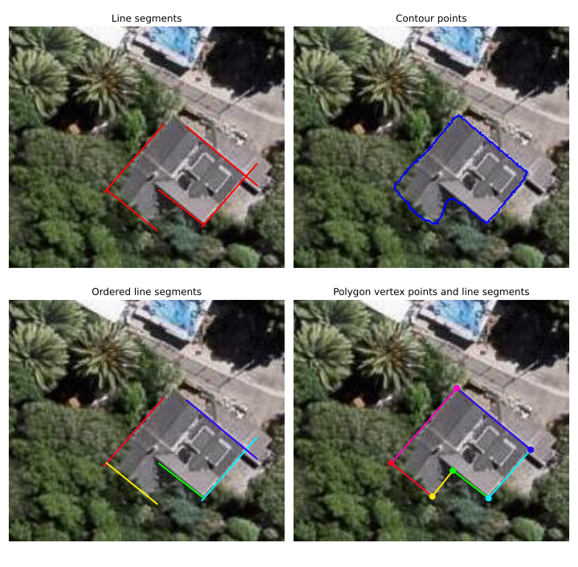

# Multi-Task Edge Detection for Building Vectorization from Aerial Images
Reference implementation for the geometry-guided reconstruction algorithms in the multi-task edge detection (MTED) framework.

## Example figures of inputs and outputs

